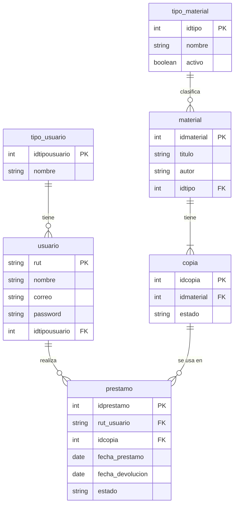
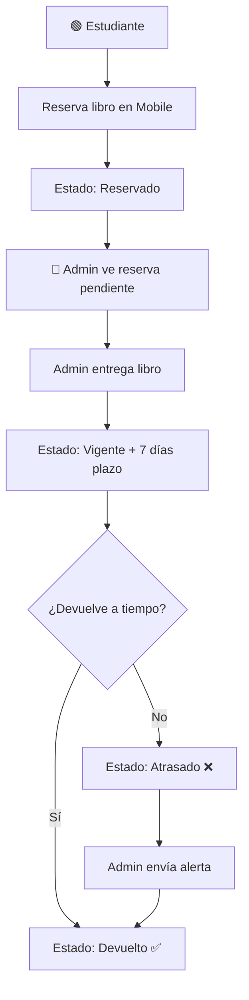

<div align="center">

# 📚 Biblioteca DuocUC

**Sistema de Gestión Bibliotecaria Integral**

[](https://python.org)
[](https://flask.palletsprojects.com)
[](https://mariadb.org) <br>

*[Ingeniería de Software — DuocUC]*

---

<p align="center">
  
</p>

</div>

## Descripción

Sistema completo de gestión bibliotecaria desarrollado para la asignatura de Ingeniería de Software en DuocUC. Permite administrar el inventario de materiales, gestionar préstamos y devoluciones, y mantener un seguimiento detallado de las operaciones del mesón bibliográfico.

### Características Principales

| Módulo | Funcionalidades |
|--------|-----------------|
| 🔐 **Autenticación** | Login por RUT, sesiones seguras, roles diferenciados |
| 📱 **Vista Estudiante** | Reservar libros, ver historial, buscar en catálogo |
| 💻 **Vista Administrador** | Dashboard, CRUD materiales, gestión de préstamos |
| 📊 **Estadísticas** | Materiales populares, contadores en tiempo real |
| 🔔 **Alertas** | Sistema de notificaciones por vencimiento |
| 📦 **Inventario** | Control de copias, estados, bajas y daños |

---

## Arquitectura del Sistema

```
┌─────────────────────────────────────────────────────────────────┐
│                    Arquitectura Cliente-Servidor                │
├─────────────────────────────────────────────────────────────────┤
│                                                                 │
│   ┌──────────────────────────────────────────────────────────┐  │
│   │                   Flask Backend (app.py)                 │  │
│   │              mysql-connector-python + Sessions           │  │
│   └──────────────────────────────┬───────────────────────────┘  │
│                                  │                              │
│                      ┌───────────┴───────────┐                  │
│                      ▼                       ▼                  │
│             ┌──────────────────┐    ┌──────────────────┐        │
│             │   Vista Mobile   │    │   Vista Desktop  │        │
│             │   (Estudiantes)  │    │   (Admin/Mesón)  │        │
│             └──────────────────┘    └──────────────────┘        │
│                                  │                              │
│   ┌──────────────────────────────────────────────────────────┐  │
│   │                   MariaDB / MySQL                        │  │
│   │           6 tablas • Relaciones completas                │  │
│   └──────────────────────────────────────────────────────────┘  │
│                                                                 │
└─────────────────────────────────────────────────────────────────┘
```

---

## Stack Tecnológico

| Componente | Tecnología | Versión |
|------------|------------|---------|
| **Backend** | Python + Flask | 3.x / 3.x |
| **Base de Datos** | MariaDB | 11.x |
| **Conector BD** | mysql-connector-python | 8.x |
| **Frontend** | HTML5 + CSS3 + JavaScript | ES6+ |
| **Estilos** | CSS Custom Properties | - |
| **Servidor** | Flask Development Server | - |

---

## Estructura del Proyecto

```
biblioteca-duocuc/
│
├── 📄 app.py                    # Backend principal (Flask)
├── 📄 requirements.txt          # Dependencias Python
├── 📄 README.md                 # Este archivo
├── 📄 .gitignore                # Archivos ignorados por Git
│
├── 📁 database/                 # Scripts de base de datos
│   ├── 📄 schema.sql            # Estructura de tablas
│   └── 📄 inserts.sql           # Datos de prueba
│
├── 📁 static/                   # Archivos estáticos
│   └── 📁 css/
│       └── 📄 style.css         # Estilos globales
│
└── 📁 templates/                # Vistas HTML
    ├── 📁 desktop/              # Interfaz de escritorio
    │   ├── 📄 index.html        # Dashboard administrativo
    │   ├── 📄 catalogo.html     # CRUD de materiales
    │   └── 📄 prestamos.html    # Historial global de préstamos
    │
    └── 📁 mobile/               # Interfaz móvil
        └── 📄 mobile.html       # App completa para estudiantes
```

---

## Modelo de Datos



### Estados del Sistema

| Entidad | Estados | Descripción |
|---------|---------|-------------|
| **Copia** | `Disponible` | Lista para ser reservada |
| | `Reservado` | Un alumno la reservó |
| | `Prestado` | Entregada físicamente |
| | `Dañado` | Fuera de circulación por daño |
| | `Baja` | Dada de baja definitivamente |
| **Préstamo** | `Reservado` | Esperando retiro en mesón |
| | `Vigente` | En posesión del alumno (7 días) |
| | `Atrasado` | Pasó la fecha de devolución |
| | `Devuelto` | Devuelta correctamente |

---

## Instalación y Configuración

### Prerrequisitos

- [Python 3.8+](https://python.org/downloads/)
- [MariaDB 10.6+](https://mariadb.org/download/)
- [Git](https://git-scm.com/downloads)

### Pasos de Instalación

```bash
# 1. Clonar el repositorio
git clone https://github.com/tu-usuario/biblioteca-duocuc.git
cd biblioteca-duocuc

# 2. Crear entorno virtual (recomendado)
python -m venv venv
source venv/bin/activate  # Linux/Mac
# venv\Scripts\activate   # Windows

# 3. Instalar dependencias
pip install -r requirements.txt

# 4. Configurar base de datos
# Iniciar sesión en MariaDB
mysql -u root -p

# Ejecutar scripts
source database/schema.sql
source database/inserts.sql
exit

# 5. Verificar conexión en app.py
# Ajustar credenciales si es necesario:
# host='127.0.0.1'
# user='root'
# password='tu_password'

# 6. Ejecutar la aplicación
python app.py
```

### Acceder al Sistema

| Vista | URL | Descripción |
|-------|-----|-------------|
| 🖥️ Desktop | `http://localhost:5000/` | Panel de administración |
| 📱 Mobile | `http://localhost:5000/m` | App para estudiantes |

---

## 👤 Credenciales de Prueba

| Rol | RUT | Contraseña | Nombre |
|-----|-----|------------|--------|
| 🔴 Administrador | `22130895-6` | `ad####23` | Sebastian Orellana |
| 🟢 Estudiante | `22163627-9` | `m###a` | Magdalena Zuñiga |
| 🟢 Estudiante | `22182484-9` | `fe######as` | Felipe Cea |

---

## 🔌 API Endpoints

### Autenticación
| Método | Endpoint | Descripción |
|--------|----------|-------------|
| `POST` | `/api/login` | Iniciar sesión |
| `POST` | `/api/logout` | Cerrar sesión |

### Estudiante (Mobile)
| Método | Endpoint | Descripción |
|--------|----------|-------------|
| `GET` | `/api/resumen_usuario` | Obtener catálogo y contadores |
| `POST` | `/api/resumen_usuario` | Reservar un libro |
| `GET` | `/api/mis_prestamos` | Historial personal |
| `POST` | `/api/devolver` | Devolver libro |

### Administrador (Desktop)
| Método | Endpoint | Descripción |
|--------|----------|-------------|
| `GET` | `/api/stats` | Estadísticas generales |
| `GET` | `/api/admin/top_materiales` | Materiales más solicitados |
| `GET` | `/api/admin/ver_reservas` | Reservas pendientes |
| `POST` | `/api/admin/entregar_libro` | Entregar libro reservado |
| `POST` | `/api/admin/todos_prestamos` | Historial completo |
| `POST` | `/api/admin/inventario` | Cambiar estado de copia |
| `POST` | `/api/admin/transaccion/prestamo` | Préstamo manual |
| `POST` | `/api/admin/transaccion/devolucion` | Devolución manual |
| `POST` | `/api/simular_alerta_vencimiento` | Enviar alerta |

### CRUD Categorías
| Método | Endpoint | Descripción |
|--------|----------|-------------|
| `GET` | `/api/categorias` | Listar categorías |
| `POST` | `/api/categorias` | Crear categoría |
| `PUT` | `/api/categorias/<id>` | Editar categoría |
| `POST` | `/api/categorias/<id>/toggle` | Activar/Desactivar |

### CRUD Materiales
| Método | Endpoint | Descripción |
|--------|----------|-------------|
| `GET` | `/api/material` | Listar con stock |
| `POST` | `/api/material` | Crear material + copias |
| `PUT` | `/api/material/<id>` | Editar material |
| `DELETE` | `/api/material/<id>` | Eliminar material |

---

## Capturas del Sistema

### Vista Móvil - Estudiante
<table>
<tr>
<td align="center">
<strong>Login</strong><br>

</td>
<td align="center">
<strong>Dashboard</strong><br>

</td>
<td align="center">
<strong>Búsqueda</strong><br>

</td>
</tr>
<tr>
<td align="center">
<strong>Detalle</strong><br>

</td>
<td align="center">
<strong>Mi Ficha</strong><br>

</td>
<td align="center">
<strong>Admin</strong><br>

</td>
</tr>
</table>

### Vista Desktop - Administrador
<table>
<tr>
<td align="center">
<strong>Dashboard</strong><br>

</td>
</tr>
<tr>
<td align="center">
<strong>Inventario</strong><br>

</td>
</tr>
<tr>
<td align="center">
<strong>Préstamos</strong><br>

</td>
</tr>
</table>

---

## 🔄 Flujo de Operaciones



---

## Requerimientos Cubiertos

| # | Requerimiento | Estado |
|---|---------------|--------|
| 1 | CRUD Tipos de Libro | ✅ Completo |
| 2 | Actualización de Inventario | ✅ Completo |
| 3 | Reserva de Materiales (máx. 3, válida 2 días)* | ✅ Parcial |
| 4 | Préstamo y Devolución de Libros | ✅ Completo |
| 5 | Consulta Materiales Populares | ✅ Completo |
| 6 | Ficha de Usuario (prestados/no devueltos/devueltos) | ✅ Completo |
| 7 | Consulta Materiales Atrasados y No Atrasados | ✅ Completo |

*La expiración automática a los 2 días es una mejora futura opcional.

---

## 👥 Desarrolladores

<div align="center">
<table>
<tr>
<td align="center">
<a href="https://github.com/Sebastia1111">
<br>
<strong>Sebastian Orellana</strong><br>
<sub>Desarrollo Full Stack</sub>
</a>
</td>
<td align="center">
<a href="https://github.com/magdzuniga">
<br>
<strong>Magdalena Zuñiga</strong><br>
<sub>Documentación y CRUD</sub>
</a>
</td>
<td align="center">
<a href="https://github.com/feliduoc">
<br>
<strong>Felipe Cea</strong><br>
<sub>Diseño y Documentación</sub>
</a>
</td>
</tr>
</table>
</div>

---

## 📄 Licencia

Este proyecto fue desarrollado con fines **educativos** como parte de la asignatura de Ingeniería de Software en DuocUC.

<div align="center">

**Hecho con ❤️ para DuocUC**

<p>

</p>

</div>

---
