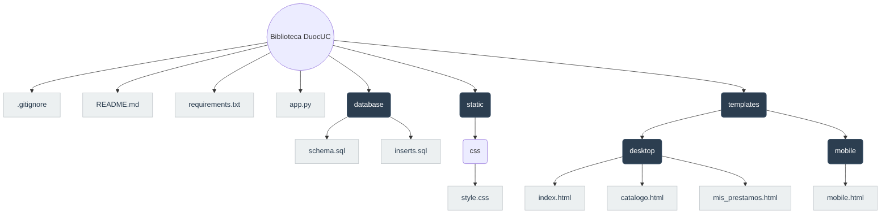

<h1 align="center">Biblioteca Académica <br>REQUERIMIENTOS</h1> <br>





# 1. Estructura BD

```sql
CREATE DATABASE IF NOT EXISTS biblioteca_duoc;
USE biblioteca_duoc;

-- 1. Tipos de Usuario (Admin, Estudiante, etc.)
CREATE TABLE IF NOT EXISTS tipo_usuario (
    idtipousuario INT AUTO_INCREMENT PRIMARY KEY,
    nombre VARCHAR(50) NOT NULL
);

-- 2. Usuarios / Alumnos
CREATE TABLE IF NOT EXISTS usuario (
    rut VARCHAR(12) PRIMARY KEY,
    nombre VARCHAR(100) NOT NULL,
    correo VARCHAR(150) NOT NULL, 
    password VARCHAR(255) NOT NULL,
    idtipousuario INT,
    FOREIGN KEY (idtipousuario) REFERENCES tipo_usuario(idtipousuario)
);

-- 3. Categorías / Tipos de Material
CREATE TABLE IF NOT EXISTS tipo_material (
    idtipo INT AUTO_INCREMENT PRIMARY KEY,
    nombre VARCHAR(100) NOT NULL,
    activo TINYINT DEFAULT 1
);

-- 4. Material Bibliográfico General
CREATE TABLE IF NOT EXISTS material (
    idmaterial INT AUTO_INCREMENT PRIMARY KEY,
    titulo VARCHAR(200) NOT NULL,
    autor VARCHAR(150) NOT NULL,
    idtipo INT,
    FOREIGN KEY (idtipo) REFERENCES tipo_material(idtipo)
);

-- 5. Copias o Ejemplares Físicos/Digitales
CREATE TABLE IF NOT EXISTS copia (
    idcopia INT AUTO_INCREMENT PRIMARY KEY,
    idmaterial INT,
    estado VARCHAR(50) DEFAULT 'Disponible', -- 'Disponible', 'Dañado', 'Baja'
    FOREIGN KEY (idmaterial) REFERENCES material(idmaterial)
);

-- 6. Historial de Préstamos
CREATE TABLE IF NOT EXISTS prestamo (
    idprestamo INT AUTO_INCREMENT PRIMARY KEY,
    rut_usuario VARCHAR(12),
    idcopia INT,
    fecha_prestamo DATE,
    fecha_devolucion DATE,
    estado VARCHAR(50) DEFAULT 'Vigente', -- 'Vigente', 'Devuelto', 'Atrasado'
    FOREIGN KEY (rut_usuario) REFERENCES usuario(rut),
    FOREIGN KEY (idcopia) REFERENCES copia(idcopia)
);
```
---
## 1.1 Insertar un Administrador y un Estudiante de prueba
```sql
USE biblioteca_duoc;

-- 1. Crear tipos (si no existen)
INSERT INTO tipo_usuario (nombre) VALUES ('Administrador');
INSERT INTO tipo_usuario (nombre) VALUES ('Estudiante');

-- 2. Crear usuarios de Prueba
-- NOTA: El password 'admin123' y '1234' son los que pusimos en el código Python

-- USUARIO ADMINISTRADOR
INSERT INTO usuario (rut, nombre, clave, idtipousuario) 
VALUES ('11111111-1', 'Admin Biblioteca', 'admin123', 1);

-- USUARIO ESTUDIANTE
INSERT INTO usuario (rut, nombre, clave, idtipousuario) 
VALUES ('22222222-2', 'Estudiante Duoc', '1234', 2);
```
---
# 2. Conexión con Python

Para conectar HTML con Python y MariaDB:<br>
> # Python:
(Obvio, pero si el entorno es Windows, necesitamos descargarlo por python.org)<br>
> # Flask:
```console
pip install flask
```

> # Conector MariaDB:
```console
pip install mysql-connector-python
```
<br>

---
# Funcionalidad
## ¿Cómo funcionará el sistema ahora?
> MariaDB: esto guardará los datos reales<br>
> Python: recibe las peticiones del html, consulta a MariaDB y devuelve el resultado en formato JSON <br>
> HTML: obvio la parte visual, esto muestra los datos que le envió python <br>
---

# Aplicación/Despliegue
## Es necesario activar el entorno antes de usar activar el app.py:
```console
source venv/bin/activate
```

### y luego ya se puede usar la app:
```console
python app.py
```
---
<br>

# SOLUCIONES
## 1. Errores con venv
Es común al parecer que hayan errores con esto ya que un archivo tan pesado como la carpeta _venv_ no se puede subir al repositorio<br>
la visión que tengo de la carpeta creada en mi entorno se ve de la siguiente forma:
```text
BIBLIOTECA/
  ├── app.py
  ├── venv/ (se queda, pero no se sube a github)
  ├── templates/
  │    ├── index.html
  │    ├── mobile.html
  │    ├── catalogo.html
  │    └── mis_prestamos.html
  └── static/
       └── style.css
```
Al no ser posible Uplodear los archivos en github de esta forma, lo que hice fue lo siguiente (MUY IMPORTANTE)<br>
#### Creé un archivo llamado .gitinore, el cual posee lo siguiente adentro:
```text
venv/
__pycache__/
*.pyc
.DS_Store
```
Esto evita que tenga que subir la carpeta venv (que ocupa mucho espacio) o archivos temporales de Python


---

# Instalación
(para facilitarle la vida otras personas)
### 1. Crear entorno virtual:
   `python -m venv venv` <br>
   `source venv/bin/activate` (Linux) o `venv\Scripts\activate` (Windows)

### 2. Instalar dependencias:
   `pip install -r requirements.txt`

### 3. Configurar Base de Datos:
Ejecuta el script SQL en MariaDB para crear la tabla `biblioteca_duoc`.

### 4. Ejecutar aplicación:
   `python app.py`
   Ir a http://localhost:5000/m

---
