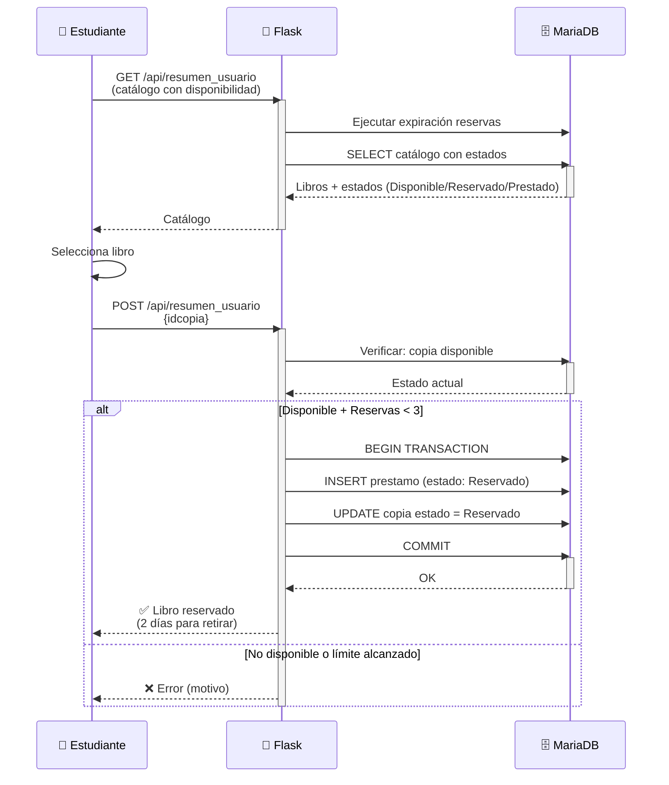
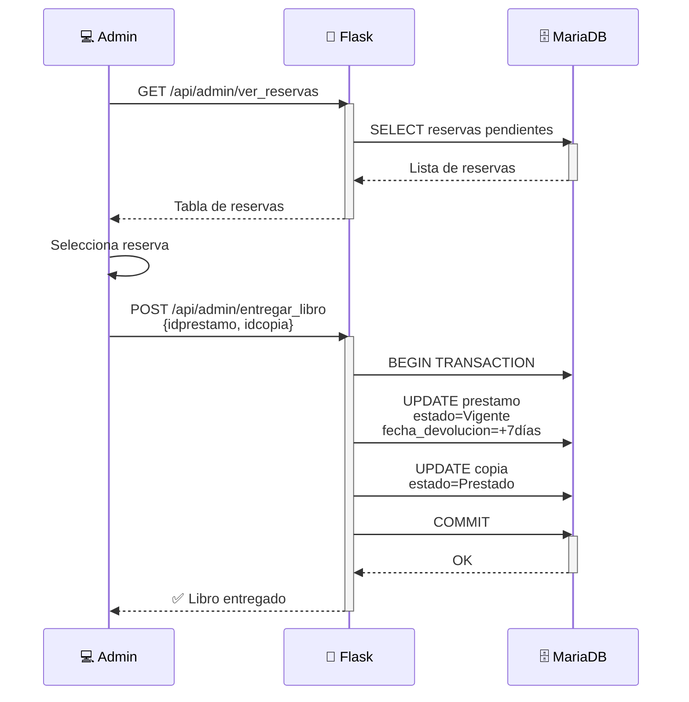
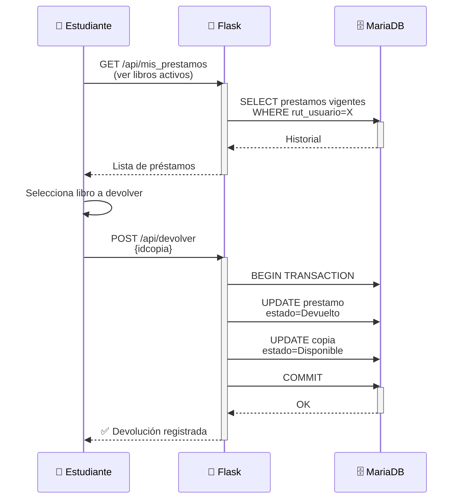
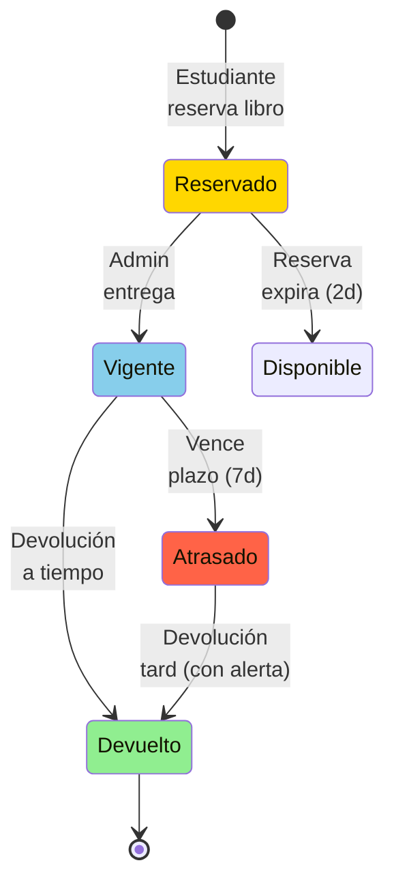
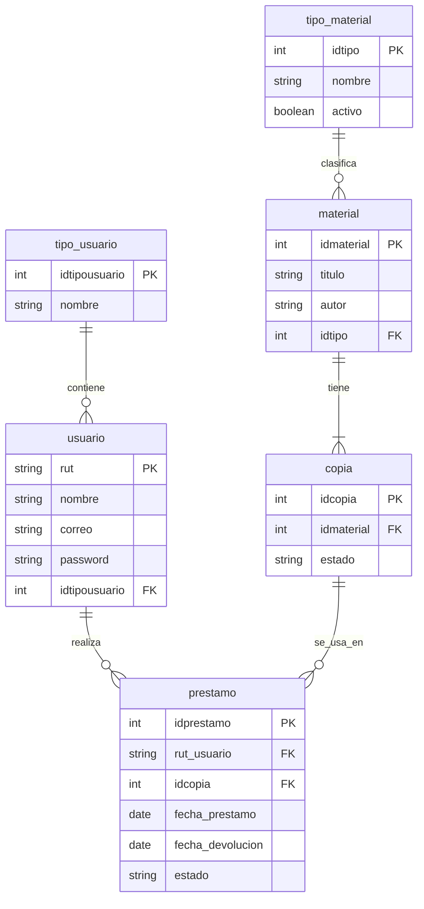
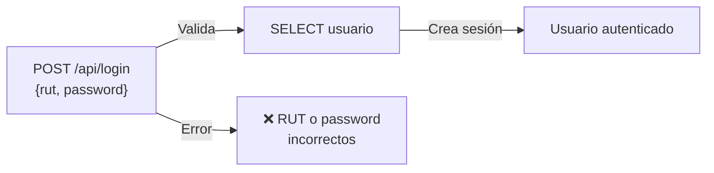
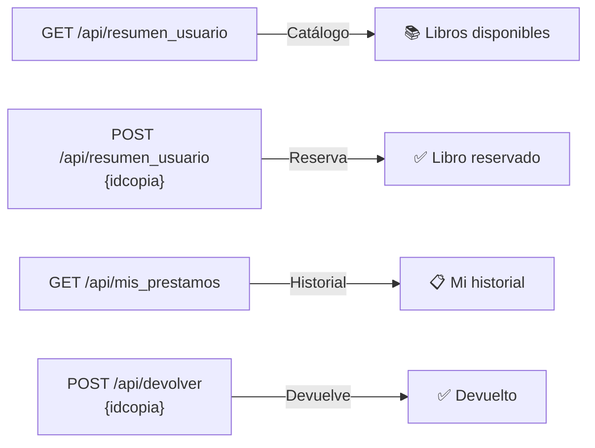
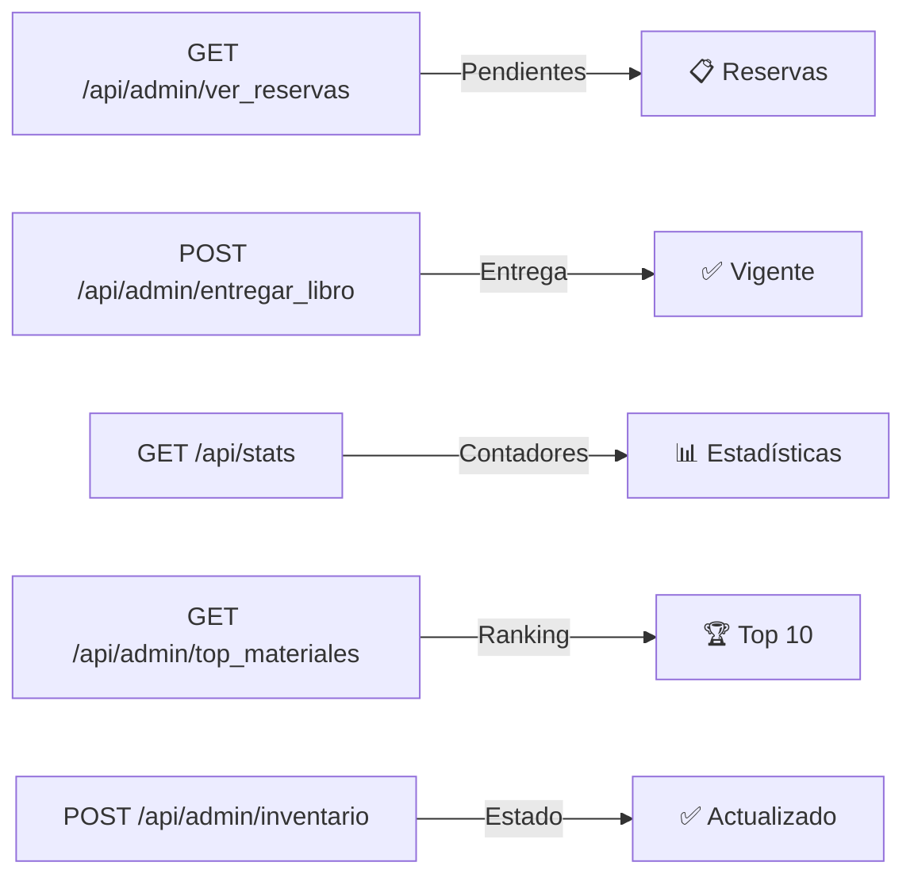
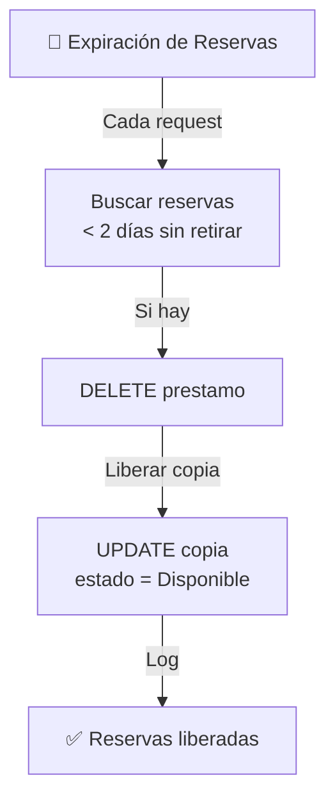

# 📊 Diagrama de Flujo de Datos - Biblioteca DuocUC

## Vista General - Arquitectura Completa

```mermaid
graph TB
    subgraph "PRESENTACIÓN"
        WEB["🌐 Vista Web<br/>HTML/CSS/JS<br/>Desktop"]
        MOBILE["📱 Vista Mobile<br/>HTML/CSS/JS<br/>Estudiantes"]
    end
    
    subgraph "BACKEND"
        FLASK["🐍 Flask Backend<br/>app.py<br/>Puerto 5000"]
        SESSION["🔐 Gestión de<br/>Sesiones<br/>RUT + ID Tipo"]
        AUTH["🔑 Autenticación<br/>Validación RUT<br/>+ Password"]
    end
    
    subgraph "LÓGICA DE NEGOCIO"
        EXPIR["⏰ Motor de Expiración<br/>Reservas < 2 días<br/>Auto-liberación"]
        NOTIF["📧 Sistema de<br/>Notificaciones<br/>Alertas por correo"]
        STATS["📊 Estadísticas<br/>Ranking Materiales<br/>Contadores"]
    end
    
    subgraph "PERSISTENCIA"
        DB["🗄️ MariaDB<br/>biblioteca_duoc<br/>6 Tablas + Relaciones"]
    end
    
    subgraph "MODELO DE DATOS"
        TIPO_U["tipo_usuario"]
        USUARIO["usuario"]
        TIPO_M["tipo_material"]
        MATERIAL["material"]
        COPIA["copia"]
        PRESTAMO["prestamo"]
    end
    
    %% Flujos Principales
    WEB -->|POST /api/login| FLASK
    MOBILE -->|POST /api/login| FLASK
    
    %% Autenticación y Sesiones
    FLASK -->|Valida RUT| AUTH
    AUTH -->|SELECT usuario| DB
    DB --> USUARIO
    USUARIO --> TIPO_U
    AUTH -->|Crea Sesión| SESSION
    SESSION -->|Guarda en memoria| FLASK
    
    %% Flujo Mobile - Operaciones Estudiante
    MOBILE -->|GET /api/resumen_usuario| FLASK
    FLASK -->|Ejecuta expiración| EXPIR
    EXPIR -->|Libera reservas vencidas| DB
    FLASK -->|SELECT catálogo| DB
    DB --> COPIA
    COPIA --> MATERIAL
    MATERIAL --> TIPO_M
    
    MOBILE -->|POST /api/resumen_usuario<br/>Reservar Libro| FLASK
    FLASK -->|Verifica disponibilidad| DB
    FLASK -->|INSERT + UPDATE| DB
    
    MOBILE -->|GET /api/mis_prestamos| FLASK
    FLASK -->|Historial personal| DB
    DB --> PRESTAMO
    
    MOBILE -->|POST /api/devolver| FLASK
    FLASK -->|Actualiza estado| DB
    
    %% Flujo Desktop - Operaciones Admin
    WEB -->|GET /api/admin/ver_reservas| FLASK
    FLASK -->|Expiración + SELECT| DB
    
    WEB -->|POST /api/admin/entregar_libro| FLASK
    FLASK -->|UPDATE prestamo<br/>UPDATE copia| DB
    
    WEB -->|GET /api/stats| FLASK
    FLASK -->|Consulta estadísticas| STATS
    STATS -->|COUNT + GROUP BY| DB
    
    WEB -->|GET /api/admin/top_materiales| FLASK
    FLASK -->|SELECT ranking| DB
    
    %% CRUD
    WEB -->|POST /api/categorias| FLASK
    FLASK -->|INSERT tipo_material| DB
    
    WEB -->|GET/POST/PUT/DELETE /api/material| FLASK
    FLASK -->|CRUD material + copia| DB
    
    %% Admin Inventario
    WEB -->|POST /api/admin/inventario| FLASK
    FLASK -->|UPDATE copia estado| DB
    
    %% Transacciones Manuales
    WEB -->|POST /api/admin/transaccion/prestamo| FLASK
    WEB -->|POST /api/admin/transaccion/devolucion| FLASK
    FLASK -->|INSERT/UPDATE| DB
    
    %% Notificaciones
    WEB -->|POST /api/simular_alerta_vencimiento| FLASK
    FLASK -->|SELECT usuario| DB
    FLASK -->|Ejecuta| NOTIF
    NOTIF -->|📧 Email| Usuario["👤 Alumno"]
    
    %% Relaciones ER
    USUARIO -->|pertenece a| TIPO_U
    MATERIAL -->|clasificado por| TIPO_M
    COPIA -->|contiene| MATERIAL
    PRESTAMO -->|usa| COPIA
    PRESTAMO -->|realiza| USUARIO
    
    style PRESENTACIÓN fill:#e1f5ff
    style BACKEND fill:#fff3e0
    style "LÓGICA DE NEGOCIO" fill:#f3e5f5
    style PERSISTENCIA fill:#e8f5e9
    style "MODELO DE DATOS" fill:#fce4ec
```

---

## 🔄 Flujo de Operaciones Principales

### Reserva de Libro (Estudiante)


### Entrega de Libro (Admin en Mesón)


### Devolución de Libro (Estudiante)


---

## 📊 Estados de Transición

### Estados de COPIA
```mermaid
stateDiagram-v2
    [*] --> Disponible: Creada
    
    Disponible --> Reservado: Estudiante<br/>reserva
    Reservado --> Disponible: Reserva<br/>expira (2d)
    Reservado --> Prestado: Admin<br/>entrega
    
    Prestado --> Disponible: Estudiante<br/>devuelve
    Prestado --> Atrasado: Vence plazo
    
    Disponible --> Dañado: Daño<br/>detectado
    Disponible --> Baja: Baja<br/>definitiva
    
    Dañado --> [*]
    Baja --> [*]
    
    style Disponible fill:#90EE90
    style Reservado fill:#FFD700
    style Prestado fill:#87CEEB
    style Atrasado fill:#FF6347
    style Dañado fill:#FF8C00
    style Baja fill:#808080
```

### Estados de PRÉSTAMO


---

## 📈 Relaciones de Base de Datos (ERD)



---

## 🎯 Mapa de Endpoints

### 🔐 Autenticación


### 📱 Mobile - Estudiante


### 💻 Desktop - Admin


---

## 🔧 Procesos Automáticos

### Motor de Expiración (2 días)


### Sistema de Notificaciones
```mermaid
graph TB
    A["📧 Alerta de Vencimiento"] -->|Admin solicita| B["SELECT usuario"]
    B -->|Obtiene correo| C["Email del alumno"]
    C -->|Envía (Demo)| D["Print en consola"]
    D -->|Producción| E["SMTP/SendGrid/etc"]
```

---

## 📊 Flujo de Datos Completo (Línea Temporal)

```
1️⃣  ESTUDIANTE INICIA SESIÓN
    ├─ Ingresa RUT + Password
    ├─ Flask: SELECT usuario
    ├─ Valida credenciales
    └─ Crea sesión con RUT

2️⃣  ESTUDIANTE VE CATÁLOGO
    ├─ GET /api/resumen_usuario
    ├─ Flask ejecuta expiración
    ├─ Libera reservas > 2 días
    ├─ SELECT catálogo con estados
    └─ Retorna libros disponibles

3️⃣  ESTUDIANTE RESERVA LIBRO
    ├─ Selecciona libro + copia
    ├─ POST /api/resumen_usuario {idcopia}
    ├─ Flask: Verifica disponibilidad
    ├─ INSERT prestamo (Reservado)
    ├─ UPDATE copia (Reservado)
    ├─ Commit transacción
    └─ ✅ Libro reservado (2 días)

4️⃣  ADMIN VE RESERVAS PENDIENTES
    ├─ GET /api/admin/ver_reservas
    ├─ Flask ejecuta expiración
    ├─ SELECT reservas WHERE estado=Reservado
    └─ Muestra tabla de pendientes

5️⃣  ADMIN ENTREGA LIBRO
    ├─ POST /api/admin/entregar_libro
    ├─ UPDATE prestamo: Vigente + fecha_devolucion=+7d
    ├─ UPDATE copia: Prestado
    ├─ Commit transacción
    └─ ✅ Libro en poder del alumno (7 días)

6️⃣  ESTUDIANTE VE SUS PRÉSTAMOS
    ├─ GET /api/mis_prestamos
    ├─ SELECT historial WHERE rut_usuario=X
    └─ Muestra libros activos + histórico

7️⃣  ESTUDIANTE DEVUELVE LIBRO
    ├─ POST /api/devolver {idcopia}
    ├─ UPDATE prestamo: Devuelto
    ├─ UPDATE copia: Disponible
    ├─ Commit transacción
    └─ ✅ Devolución registrada

8️⃣  ADMIN GENERA ESTADÍSTICAS
    ├─ GET /api/stats
    ├─ COUNT agregados por estado
    ├─ SELECT top 10 materiales
    └─ Muestra dashboard con números

9️⃣  ADMIN ENVIA ALERTA (Si atraso)
    ├─ POST /api/simular_alerta_vencimiento
    ├─ SELECT usuario
    ├─ Obtiene correo + datos
    ├─ Envía email (Demo: Print)
    └─ 📧 Alumno recibe notificación
```

---

## 🎓 Notas Técnicas

### Transacciones
- `BEGIN TRANSACTION` para operaciones críticas
- `COMMIT` en éxito
- `ROLLBACK` en error
- Previene inconsistencias entre `prestamo` y `copia`

### Seguridad
- Sesiones Flask en memoria
- RUT + Password (en producción: hash)
- Validación de RUT antes de operaciones

### Performance
- Índices en `rut_usuario` (prestamo)
- Índices en `idcopia` (copia, prestamo)
- Caché implícito por expiración automática

---

## 📁 Archivos Relacionados
- `app.py` — Lógica de endpoints
- `database/schema.sql` — Estructura BD
- `database/inserts.sql` — Datos iniciales
- `templates/desktop/index.html` — Admin UI
- `templates/mobile/mobile.html` — Estudiante UI
- `static/css/style.css` — Estilos globales

---

**Generado:** 2026-07-17  
**Versión:** 1.0  
**Mantenedor:** Equipo Biblioteca DuocUC
